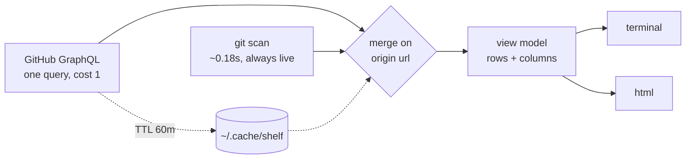

```
 ███████╗██╗  ██╗███████╗██╗     ███████╗
 ██╔════╝██║  ██║██╔════╝██║     ██╔════╝
 ███████╗███████║█████╗  ██║     █████╗
 ╚════██║██╔══██║██╔══╝  ██║     ██╔══╝
 ███████║██║  ██║███████╗███████╗██║
 ╚══════╝╚═╝  ╚═╝╚══════╝╚══════╝╚═╝
```

<div align="center">

### `EVERY REPO YOU HAVE // INCLUDING THE ONES GITHUB CANNOT SEE`

*the union of your GitHub account and your hard drive, in one table*


</div>

---

## 📚 What is this

`gh repo list` gives you names and nothing else. github.com gives you one repo at a
time and works fine until you have forty. Neither knows anything about the machine
you are sitting at, so neither can tell you that you have uncommitted work in three
places, or that five repos exist nowhere but this laptop.

shelf pulls both sides and merges them on the origin URL. Every repo comes back
labelled `synced`, `remote` or `local`, sorted by whatever you touched most
recently, with an eight-week commit sparkline so you can see which things are
actually moving. The GitHub half is one GraphQL query, cached for an hour. The
local half is a git scan that takes under two tenths of a second, so it runs every
single time.

It reads. It never writes to GitHub, never clones, never archives anything on your
behalf. The worst it can do is tell you the truth about `Pygame-Games`.

```console
nick@shelf:~$ shelf
[✓] 46 repos · github 22m ago · local live
[i] 5 of them exist only on this machine. you knew about two.
```

## 🗄 The table

| | column | what it actually shows |
|---|---|---|
| 01 | **repo** | name, dimmed when archived, linked when rendered as html |
| 02 | **age** | time since the newest of: github push, local commit |
| 03 | **8 weeks** | commit shape, oldest week on the left, scaled to that repo's own busiest week |
| 04 | **commits** | the magnitude the sparkline deliberately does not carry |
| 05 | **iss** | open issues, blank rather than `0` — a zero you have to read is noise |
| 06 | **state** | `● synced` · `▲ remote` · `○ local` — matched on origin url, never on folder name |
| 07 | **note** | `UNPUBLISHED`, dirty and unpushed counts, `archived`, `private`, failing ci |

## 🔍 The four commands

| | command | what it actually does |
|---|---|---|
| 01 | `shelf` | triage. warm repos in full, cold ones collapsed to a single line |
| 02 | `shelf audit` | five checks. empty ones print a tick instead of hiding, so the output stays honest |
| 03 | `shelf show <repo>` | one repo, one screen. everything cached, plus one live call for commits and ci |
| 04 | `shelf index` | every public non-fork grouped by language — the uncurated long tail, meant for `-o` |

Every one of them takes `--json` for machines and `--html` for a browser.

## 🖥 The browser view

`--html` serves a page on a random loopback port that looks like what the tool is:
all monospace, on a real character grid, framed like a TUI, deep black with ANSI
accents that only ever carry meaning. The counts across the top are `[x]` filters, `group` buckets rows by
state or language or activity, every column header sorts, and the activity column
is a real chart whose bars tell you the week and the commit count when you point at
them. `/` focuses the filter, `j`/`k` move, `enter` opens the repo, `esc` clears.

Click a row and a card slides in from the right: facts, language makeup, latest
release, the activity chart, recent commits, and the README rendered in place —
ASCII-art banners intact, because fenced code is reproduced verbatim and images
become their alt text rather than loading. The table stays put, so `j`/`k` walks
the list with the card following along. `o` opens GitHub — or tells you why it can't, since six of your repos aren't there. `esc` closes.

Refresh swaps the data in place over `/api/data` with a progress bar rather than
reloading, because a cold GitHub fetch takes ten seconds and a page that freezes for
ten seconds looks broken.

`-o FILE` writes the same page as a static file — filtering, grouping and charts
intact, refresh button gone. Both render from a JSON model embedded in the document,
so the page needs JavaScript and nothing else; there is no network request in it.

## 🚀 Run it

Needs [Bun](https://bun.sh) and either `GITHUB_TOKEN` set or `gh` logged in.

```bash
git clone https://github.com/nitrimandylis/shelf.git
cd shelf
bun run compile   # → ~/.bun/bin/shelf, and man shelf into your manpath
shelf
man shelf         # full reference, offline
```

First run writes `~/.config/shelf/config.json` and takes about ten seconds while
GitHub thinks about it. Every run after that is 0.1s until the cache turns an hour
old. Most of that cold cost is the eight weekly commit counts — metadata alone
returns in four.

## 🤖 Agent skill

`shelf-cli/SKILL.md` is operating instructions for whatever agent you point at this
tool — the json contract, the traps, and the list of things shelf deliberately
cannot do. `bun run compile` installs it alongside the binary and the man page, so
the three cannot drift apart.

The split it encodes: every command here is safe to run unattended except `--html`,
which starts a server and never returns. Agents should reach for `-o FILE` instead
and hand the browser command to a human.

## 🔩 Under the hood



| layer | path | job |
|---|---|---|
| entry | `shelf.ts` | arg parsing, four commands, the json shapes |
| github | `github.ts` | one graphql query, the cache, token resolution |
| local | `local.ts` | repo discovery, `status --porcelain=v2` parsing, weekly buckets |
| model | `model.ts` | merge, sparkline, widths, the audit checks — all pure, all tested |
| views | `views.ts` | one data model both renderers read |
| render | `term.ts` · `html.ts` | ansi table · self-contained page that renders from the same model as JSON |

Eight weekly commit counts come back as aliased `history(since:, until:)` totals
rather than a node list, because a node list caps at 100 and silently drops the
oldest weeks on a busy repo. That is the kind of bug you find six months later
while trusting a chart.

**Stack:** Bun · TypeScript · GitHub GraphQL · git · zero runtime dependencies

---

<div align="center">

**[Nick Trimandylis](https://github.com/nitrimandylis)**

`FORTY REPOS IS TOO MANY TO REMEMBER AND NOT ENOUGH TO SEARCH`

MIT licensed.

</div>
